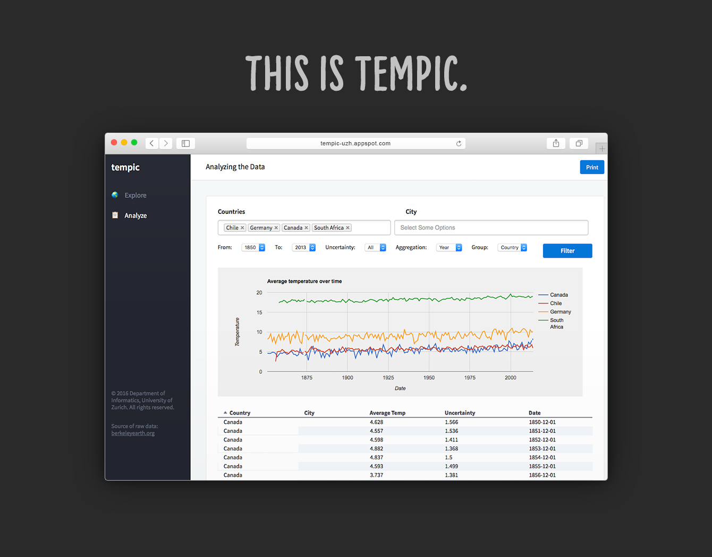

# Tempic

Project for the Software Engineering lecture in Autumn Semester 2016 @ University of Zurich (UZH).

The app was built on Google's Web Toolkit Framework (GWT). See [here](http://www.gwtproject.org) for more details about GWT.

## Final project result

 

## Live Demo

~~Our app is live on Google's App Engine: [www.tempic-uzh.appspot.com]~~ ~~(http://www.tempic-uzh.appspot.com)~~

## Contributors

* **Martin Bucher** - [mnbucher](https://github.com/mnbucher)
* **Sebastian Richner** – [SRichner](https://github.com/SRichner)
* **Michael Ziörjen** – [miczed](https://github.com/miczed)
* **Robin Kaufmann** – [relaxia](https://github.com/Relaxia)

See also the list of [contributors](https://github.com/mnbucher/olat/contributors) who participated in this project.

## Technical Stuff
### MYSQL Connection
In order to connect to the Google Cloud SQL Server when running the app locally you need to be in the UZH IP Adress range.
We restricted the access to the server to prevent other users from querying our database.
So any IP in the range between **89.206.0.0** and **89.206.255.255** is able to query the database (given the correct credentials were used.)

### Edit Database
In order to edit the database you'll need a MySQL Client ([Sequel Pro Mac](https://www.sequelpro.com/) or [MySQL Workbench Mac / Windows](https://dev.mysql.com/downloads/workbench/)).
The access credentials are stored in the dropbox under **passwords.txt**. 

### Database Structure
The database currently only has one table with the following columns:


## Project Structure
### Presenters
All Presenters belong to the package **com.uzh.client.presenter** and implement the **presenter** interface

### Models
Models are shared on the server and on the client. They belong to the package **com.uzh.client.shared**.

### Views
All Views belong to the package **com.uzh.client.view**.

### Handling Events
Every UI element that the presenter should now about (in order to react to events) should be returned by a function declared inside the presenter's **display interface**:
```java
public interface Display {
    HasClickHandlers getFilterButton();
}
```

In the presenter's **bind** method we can then attach an event handler to the UI elements returned by the view:
```java
public void bind() {
    display.getFilterButton().addClickHandler(new ClickHandler() {
        public void onClick(ClickEvent event) {
            Window.alert("Button clicked, yayy!");
        }
    });
}
```
In the view itself we need to define a function which returns the object to the presenter:
```java
public HasClickHandlers getFilterButton() {
    return filterBtn;
}
```
